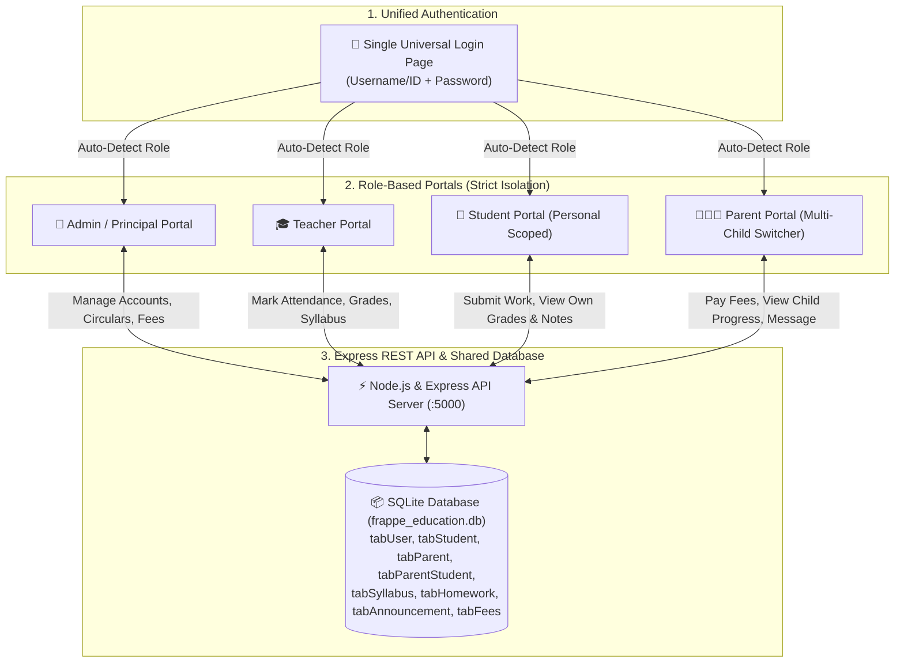

# Nairee — School Management ERP

> **A role-based school management platform replicating the database schema and business workflows of Frappe Education. Built to run natively on Windows and Android.**

---

## 🌐 Live System URLs

| Component | URL | Purpose |
| :--- | :--- | :--- |
| **Web Portal** | [**http://localhost:5173**](http://localhost:5173) | Single Login Page & 4 Role Portals (Admin, Teacher, Student, Parent) |
| **Backend REST API** | [**http://localhost:5000**](http://localhost:5000) | Express & SQLite Persistence Engine (Frappe DocType tables) |
| **Android Companion** | `mobile/` (Expo v52) | React Native Android Student Pass & Schedule App |

---

## 🔑 Demo Login Credentials (Single Login Form)

There is **only one single login form** for all users. The backend auto-detects the user's role and automatically routes them to their dedicated portal:

| Role | Username | Password | User Profile | Scoped Features |
| :--- | :--- | :--- | :--- | :--- |
| **Admin / Principal** | `admin` | `admin123` | Dr. Marcus Vance (Principal) | Executive dashboard, account issuance (auto-links parent), teacher workload & syllabus, at-risk monitoring, announcements, CSV reports |
| **Teacher** | `teacher_jenkins` | `teacher123` | Prof. Sarah Jenkins (Head of Math) | Class timetable, bulk attendance marking, live syllabus progress tracker, homework create & grade, exam marks entry, parent messaging |
| **Student** | `nairee` | `student123` | Nairee Patel (Roll #101) | Digital student pass, personal timetable, homework submit modal, study notes/PDFs, report card, bus route, school calendar |
| **Parent** | `parent_patel` | `parent123` | Rajesh Patel (Father) | **Multi-child switcher** (Nairee Patel & Rohan Patel), attendance alerts, grade trends, online fee payment with receipts, live syllabus, message teacher |

*(A 1-click test credentials drawer is also available on the login page for effortless testing!)*

---

## 🏛️ System Architecture & Data Flow



---

## ⚡ How Everything Connects (Data Flow Rules)

The single shared SQLite database ensures that data is never duplicated and propagates across portals in real time:

1. **Teacher marks attendance** &rarr; instantly reflected in the student's attendance percentage and in the parent's daily attendance ledger with instant absence alerts.
2. **Teacher enters exam marks or grades homework** &rarr; automatically updates the student's report card, the parent's progress view, and rolls up into the Admin's class performance stats.
3. **Teacher updates syllabus progress** &rarr; live progress bars in both the Student and Parent portals immediately reflect completed topics vs. remaining before exams.
4. **Teacher assigns homework or uploads study materials** &rarr; immediately appears in the student's portal with an interactive submission modal.
5. **Admin creates a student account** &rarr; the system auto-generates a linked Parent account, issues credentials, and creates a default fee invoice.
6. **Parent pays fee online** &rarr; generates an official receipt (`REC-2026-XXXXX`), clears the balance, and updates the school's total collection metrics in the Admin portal.
7. **Admin broadcasts an announcement** &rarr; instantly visible across targeted portals (all, teachers, students, or parents).

---

## 🚀 Quick Launch Guide (Windows)

All dependencies and runtimes are pre-installed.

### Launch All Services in 1-Click
Open PowerShell in the project directory and execute:
```powershell
.\start-all.ps1
```
This opens the Backend API (`:5000`) and Web Portal (`:5173`) in independent PowerShell windows.

### Individual Launch Commands
- **Backend API**:
  ```powershell
  cd backend
  node src/server.js
  ```
- **Web App**:
  ```powershell
  cd web
  npm.cmd run dev
  ```
- **Mobile App**:
  ```powershell
  cd mobile
  npm.cmd start
  ```

---

## 🛡️ Security & Access Control
- **No Self-Registration**: Accounts are issued exclusively by the School Administrator.
- **Backend Route Scoping**: Student APIs are strictly scoped to the authenticated student ID. Parent APIs are strictly scoped to verified children in `tabParentStudent`.
- **Session Continuity**: Browser session stored in encrypted `localStorage`, with 1-click Sign Out.
