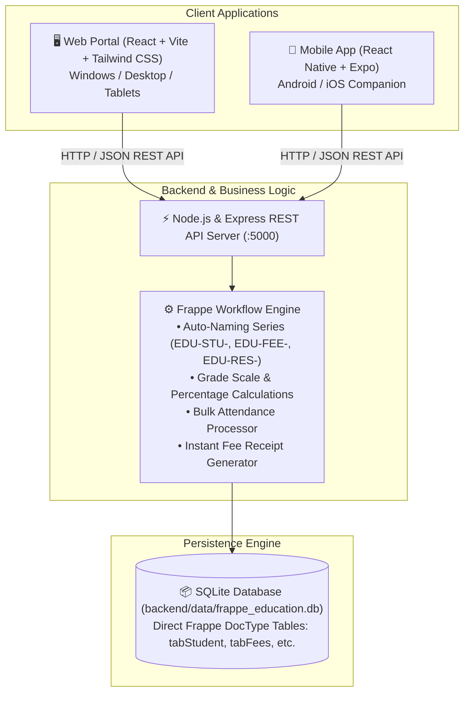

# Frappe Education — Nairee School Management System

> **A high-performance, professional school management platform directly replicating the database schema, DocTypes, and business workflows of [Frappe Education](https://github.com/frappe/education), designed to run natively on Windows and Android.**

---

## 🏛️ System Architecture



---

## 🌟 Key Modules & Workflows Replicated

### 1. Student Directory & Profiles (`tabStudent`, `tabGuardian`)
- Direct implementation of Frappe's `tabStudent` schema with auto-naming series `EDU-STU-YYYY-XXXXX`.
- Comprehensive records including personal bio, roll numbers, blood group, contact info, and guardian parent relationships (`tabGuardian`).
- **Interactive Student Dossier Drawer** featuring 4 detailed tabs:
  - **Bio & Guardians**: Complete contact information, relationship types, and residential address.
  - **Attendance History**: Cumulative attendance percentage gauge and historical daily logs.
  - **Academic Grades**: Subject marks, percentages, letter grade badges, and faculty remarks.
  - **Fee Ledger**: Itemized billing breakdown and verified payment status.

### 2. Frappe Bulk Attendance Tool (`tabStudentAttendance`)
- Replicates the official Frappe bulk attendance tool interface.
- Select any student batch and calendar date.
- One-click **"Mark All Present"** or individual status toggling (`Present`, `Absent`, `Late`, `Excused`).
- Submits attendance in real-time and recalculates class and student attendance percentages instantly.

### 3. Subject Schedule & Timetable (`tabSubjectSchedule`, `tabCourse`, `tabProgram`)
- Weekly academic timetable grid (Monday through Friday) mapping classrooms, time slots (08:30 – 15:30), subjects, and faculty professors.
- Color-coded subject blocks (Advanced Mathematics, Computer Science, Physics Lab, Literature).
- Filter by student batch or specific day of the week.

### 4. Examination Gradebook & Report Cards (`tabAssessmentPlan`, `tabAssessmentResult`)
- Examination criteria with maximum scores and syllabus weightages (`tabAssessmentPlan`).
- Marks entry modal for teachers with auto-calculation of percentages and letter grade mapping (`A+`, `A`, `B+`, `B`, `C`, `F`).
- Report card view featuring class rankings and faculty comments.

### 5. Fees & Invoicing Workflow (`tabFees`, `tabFeeComponent`)
- Invoices generated with itemized fee components (Tuition, Lab Fee, Library, Sports).
- **Interactive "Pay Now" Workflow**:
  - Select payment gateway (Credit Card / Stripe, Apple Pay, Bank Wire).
  - Processes balance clearing, sets `outstanding_amount = 0`, switches status to `Paid`.
  - Generates official printable payment receipts (`REC-2026-XXXXX`).

### 6. Role-Based Perspective Switcher
Switch views effortlessly using the top navigation dropdown:
- **👑 School Admin**: Full institutional overview, financials, batch allocation, and student directory.
- **🎓 Faculty / Teacher**: Rapid attendance marking tool and exam grade entry.
- **🌟 Student Portal (Nairee)**: Digital student ID card, personal timetable, attendance gauge, and fee payment reminders.

---

## 📱 Android Mobile Companion App (`mobile/`)

Built with **React Native & Expo**, the mobile application brings Nairee's student portal directly to Android phones:
- **Holographic Digital Student ID Card**: Complete with student photo, student ID, blood group, emergency contact, and a campus access barcode mockup.
- **Today's Class Schedule**: Real-time timeline view with classroom locations and faculty names.
- **Attendance Donut**: Visual gauge tracking presence percentage.
- **Mobile Fee Payments**: Push reminder for pending tuition fees with Google Pay integration simulation and instant receipt generation.

---

## 🚀 Quick Start Guide (Windows)

All runtimes (Node.js, npm, Python, Git) are already configured on your machine.

### Method 1: One-Click Startup (Recommended)
Open PowerShell in the project directory and run:
```powershell
.\start-all.ps1
```
This automatically launches the Backend API and Web Portal in separate PowerShell windows!

---

### Method 2: Manual Component Startup

#### 1. Start Backend API
```powershell
.\start-backend.ps1
# Or manually:
cd backend
npm start
```
> Server runs on: `http://localhost:5000`

#### 2. Start Web Portal
```powershell
.\start-web.ps1
# Or manually:
cd web
npm run dev
```
> Open browser at: `http://localhost:5173`

#### 3. Start Android Mobile App
```powershell
.\start-mobile.ps1
# Or manually:
cd mobile
npx expo start
```
> **To test on Android:** Install the free **Expo Go** app from the Google Play Store on your Android phone, and scan the QR code displayed in the terminal!

---

## 🔄 Re-seeding Demo Data
To reset or re-seed the SQLite database with fresh demo data at any time:
```powershell
cd backend
node src/seed.js
```

---

## 🐙 Connecting to GitHub

To push this project to your own GitHub account:

1. Create a new repository on [GitHub](https://github.com/new) (e.g. `nairee-school-project`).
2. Run the following commands in PowerShell from the project root:
```powershell
git remote add origin https://github.com/<YOUR-USERNAME>/<YOUR-REPO-NAME>.git
git branch -M main
git push -u origin main
```
